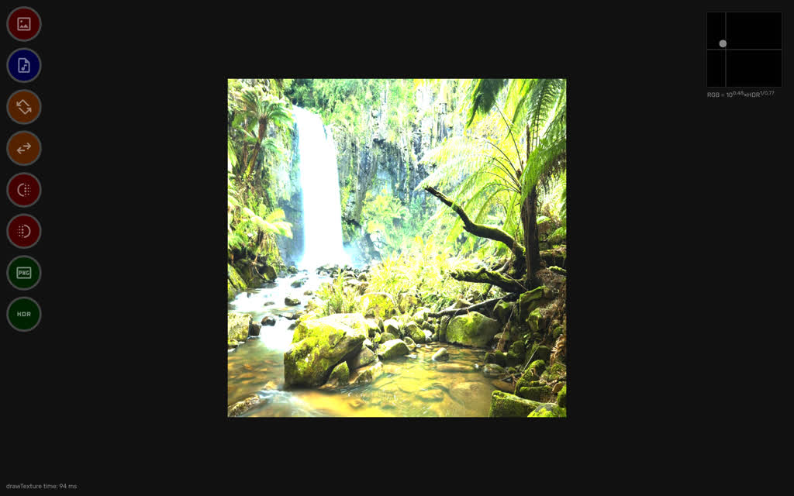
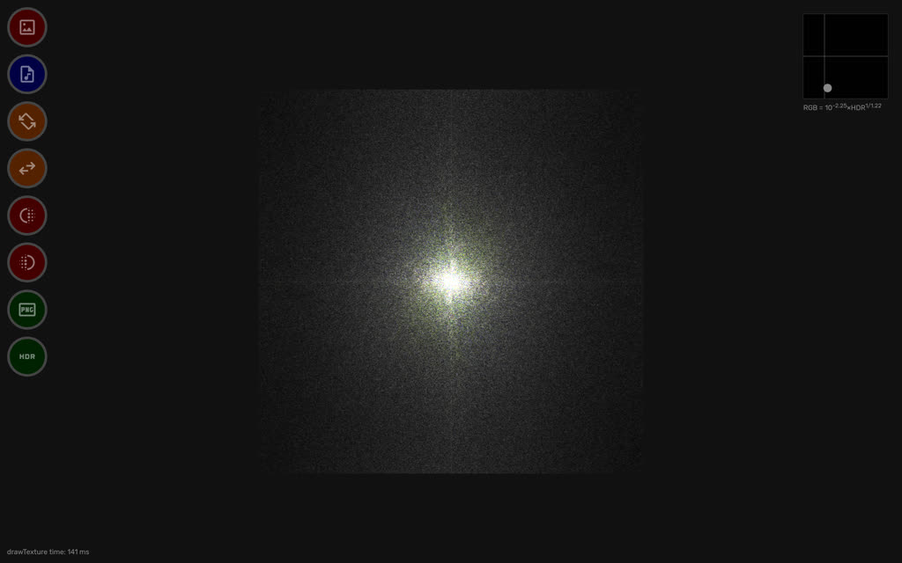
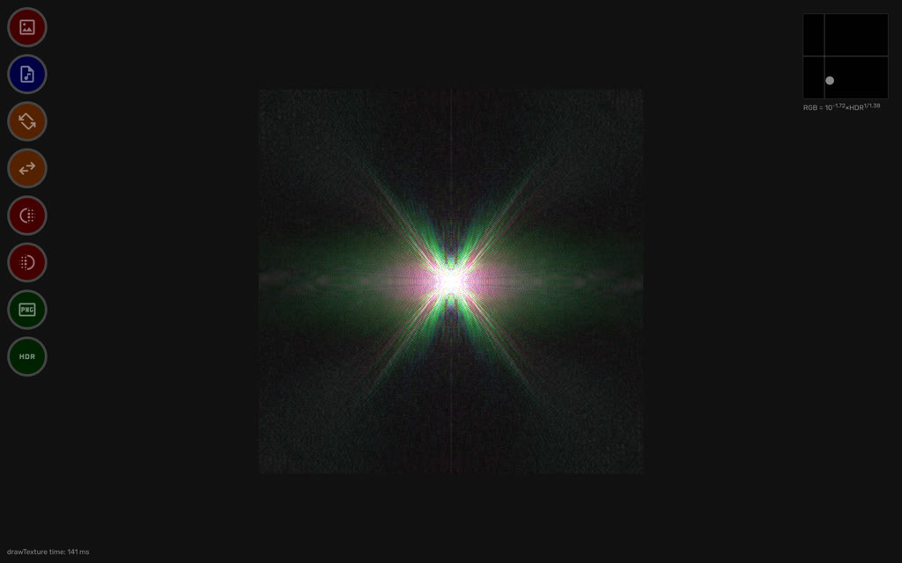
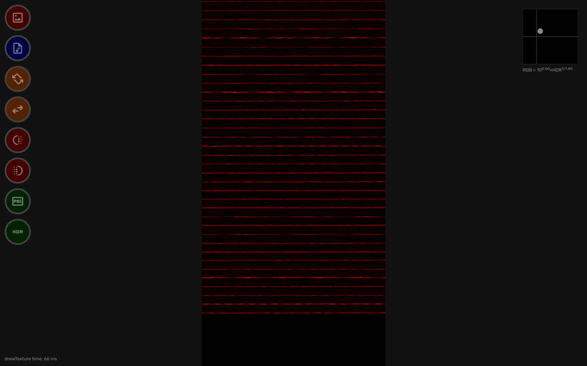
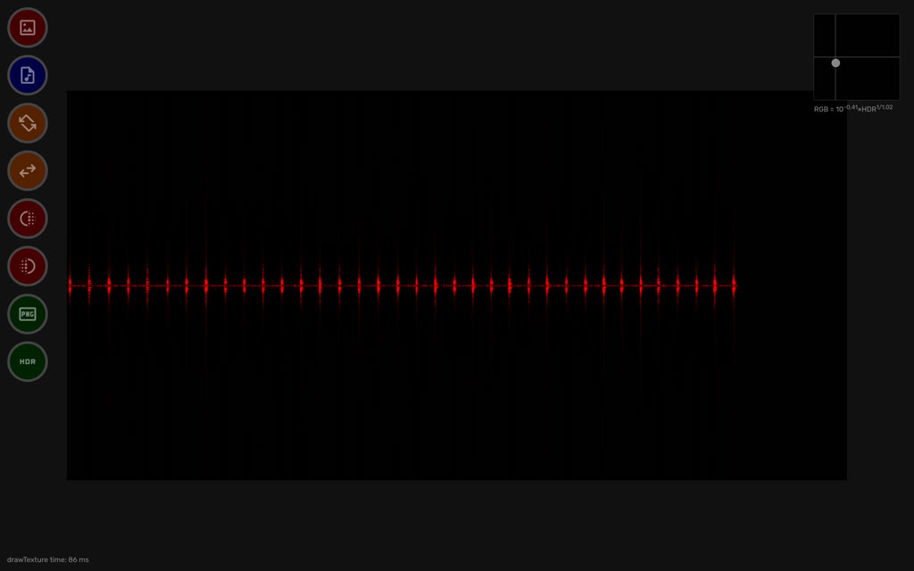
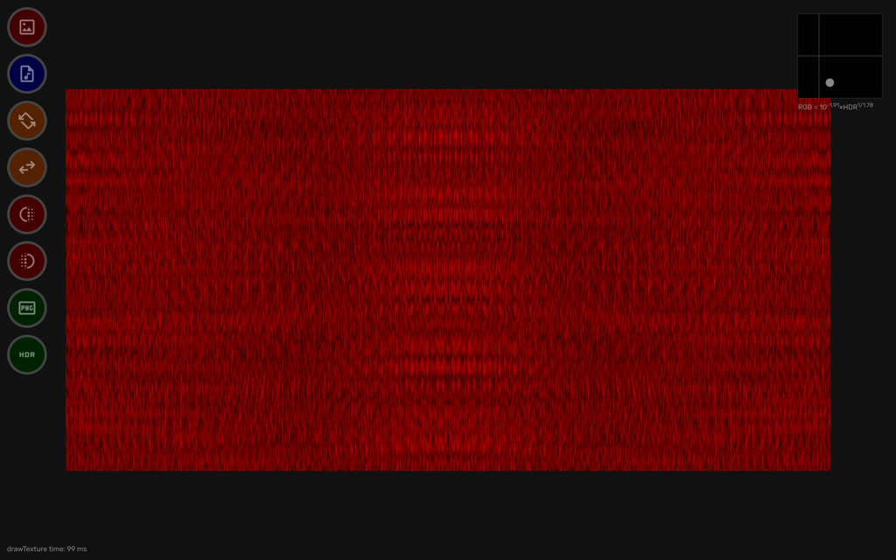

A simple, but fast [webfft.js](lib/webfft.js) library based on the Cooley-Tukey DIF algorithm. Demo: [webfft.net](https://webfft.net).

There is a basic UI that works with a 2048×1024 texture. It can apply per-row FFT, which can be paired with transposition to compute 2D FFT. Internally, the texture is kept in the float32 format, and with a basic gamma-correction it's mapped to RGB. The texture can be saved as:

  - PNG in the RGB×int16 format
  - EXR in the RGB×float32 format

### Images

### Audio

48 kHz audio is first loaded into an array of samples and then recasted into the 2048×1024 texture. Each row in the texture becomes a 20ms audio frame. Then per-row FFT can be applied.

### License

Public Domain
