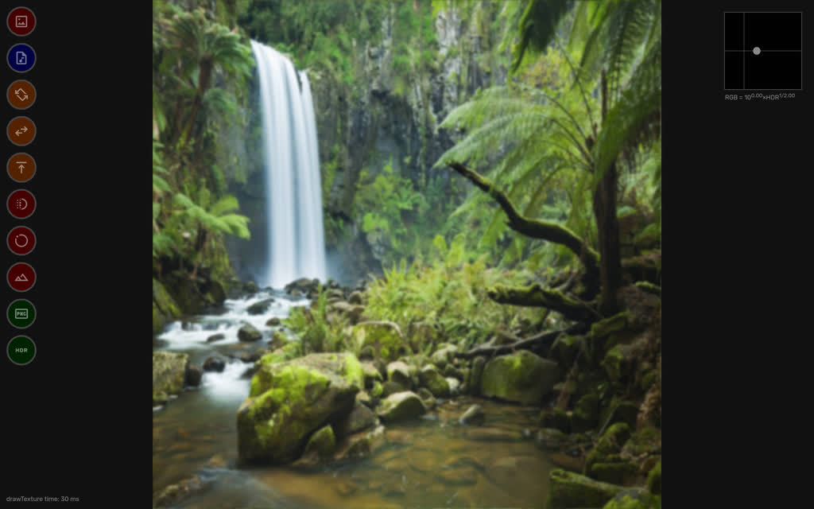
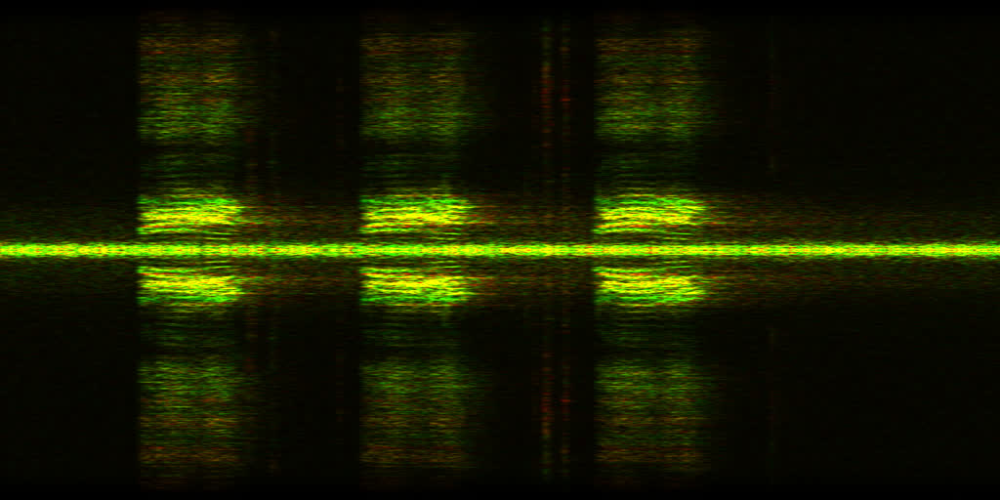
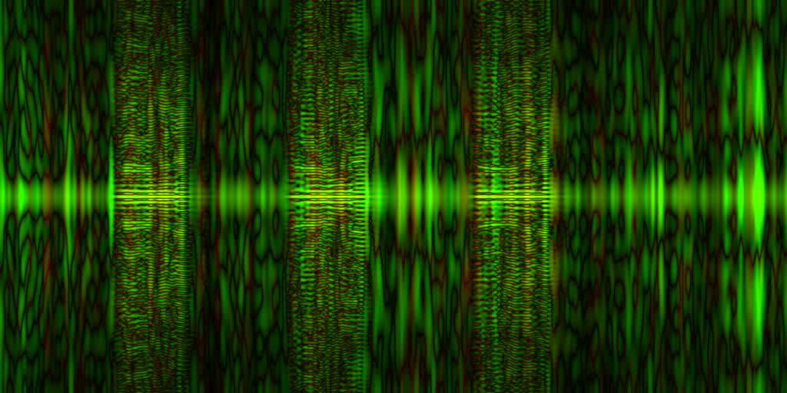

A simple, but fast [webfft.js](lib/webfft.js) library based on the Cooley-Tukey DIF algorithm. Demo: [webfft.net](https://webfft.net).

### Images

There is a basic UI that works with a 3-channel 1024×1024 float32 texture. Slow operations run on 3 background threads, one per texture channel.

The UI doesn't have a button to compute 2D FFT, but it provides a set of simpler operations that can be chained together to make 2D FFT:

  1. Apply the per-row FFT.
  2. Transpose the texture.
  3. Apply the per-row FFT again.
  4. Transpose the texture again.

The picture can be blurred by applying a gaussian window to high frequencies:

  1. FFT on rows.
  2. Gaussian window x 20.
  3. Transpose.
  4. FFT on rows.
  5. Gaussian window x 20.
  6. Transpose.

Inverse FFT can be done this way:

  1. Conjugate: (re, im) -> (re, -im).
  2. FFT on rows.
  3. Conjugate again.
  4. Transpose.
  5. Conjugate.
  6. FFT on rows.
  7. Conjugate.
  8. Transpose.

The texture can be saved as:

  - PNG in the RGB×int16 format.
  - EXR in the RGB×float32 format.

### Audio

48 kHz audio is first loaded into an array of samples (aka the waveform) and then interpreted as a 2048×1024 texture. The pair of stereo channels map to (re,im) components. Thus 5.1ch audio maps to the three RGB (re,im) channels. Each row in the texture becomes a 20ms audio frame. Then per-row FFT can be applied.

Here is an example. Download a birdsong from [https://xeno-canto.org/927288](https://xeno-canto.org/927288) and apply the following steps:

  1. Shift right.
  2. Gaussian window x 3 times.
  3. FFT on rows.
  4. Shift right.
  5. Transpose.
  6. Adjust HDR brightness in the top-right corner.

Red and green correspond to the 2 stereo channels in the audio file.

Autocorrelation can be computed from this texture:

  1. Transpose to restore the original "audio frame per row" layout.
  2. Square amplitudes: re^2+im^2.
  3. FFT on rows. This is identical to inverse FFT because at this point each row is symmetrical and purely real.
  4. Shift right.
  5. Transpose.

Another option is to compute the [Radon transform](https://en.wikipedia.org/wiki/Radon_transform):

  1. Map the FFT image to polar coordinates.
  2. Apply the 2D FFT.

### License

Public Domain
