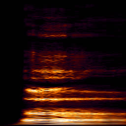
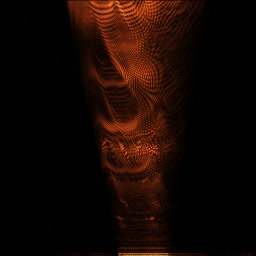
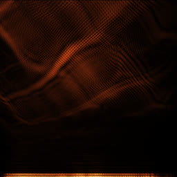
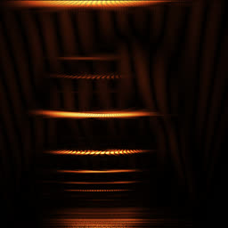

# Wavelet Transform

_08/2023_

This sound visualization is inspired by the [continuous wavelet transform](https://en.wikipedia.org/wiki/Continuous_wavelet_transform).

CWT convolves a signal with a usually simple wavelet function (e.g. the [Morlet wavelet](https://en.wikipedia.org/wiki/Morlet_wavelet)) at different scales. When applied to sounds, the end result is very similar to a spectrogram, but smoother and with slightly more details. In order to get good results, the Morlet wavelet needs to have ~30 repetitions with a small fixed-size padding.

_A vowel sound, 500 ms, sample rate: 48 kHz, displayed range: 0-12 kHz._

However the wavelet function can be an arbitrary signal, including the signal that's being analyzed. In that case, the input signal will be convolved with the wavelet signal at different scales.

