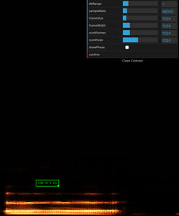
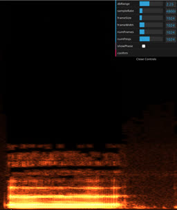
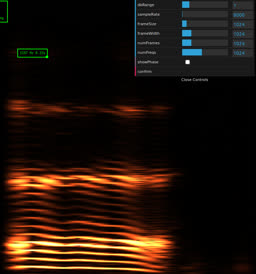
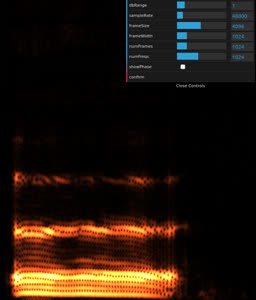
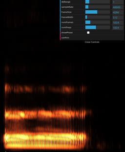
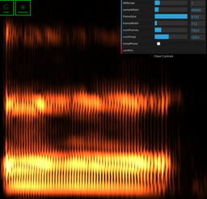
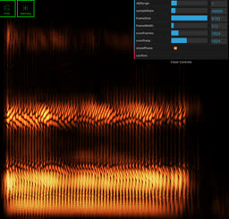

# Fast spectrogram analyzer

_08/2023_

Works on mobile browsers.

## Settings

**dbRange** controls the brightness of the image with `10*(fft.re^2 + fft.im^2)^(0.5/dbRange)`. This basic formula allows to see more details than the traditional log10-based scaling.




**sampleRate** controls how AudioContext decodes audio. It should match the sample rate of the audio file. The max computed frequency is `sampleRate/2`. Lowering the sample rate allows to zoom the spectrogram vertically:




The downside is that the audio file has to be decoded again.

**frameWidth** controls the number of audio samples per frame. It doesn't have to be a power of 2, but it must be smaller than _frameSize_, for each frame is zero-padded to _frameSize_ to compute FFT. Usually, _frameWidth_ correponds to 20-200 ms worth of samples, which is `48000/1000*20`..`48000/1000*200` samples at 48 kHz. Lowering _frameWidth_ increases time resolution at the expense of frequency resolution:




**frameSize** is the FFT size, must be a power of 2. Increasing it allows to compute more frequencies at smaller step, and if the number of shown frequencies stays the same, the spectrogram image zooms vertically:


Increasing _frameSize_ and _numFreqs_ simultaneously will add finer details to the image, while preserving its overall shape.

**numFrames** controls how many equally-spaced frames shall be captured and it's also the image width.

**numFreqs** controls how many frequencies shall be shown and it's also the image height. It's capped by `frameSize/2` because that's how many frequencies FFT computes. The reason _numFreqs_ can be made lower is to see the low frequencies at high resolution. In practice, what really matters is the ratio `numFreqs/frameSize`, so _numFreqs_ stays the same, while _frameSize_ is changed.

**showPhase** drops the `fft.im` component to show the phase. This turns DFT into DCT.




## How it works

- Mic capture: getUserMedia + AudioWorkletNode, lossless, up to 48 kHz, although you may try higher sample rates.
- Audio decoding: AudioContext, up to 384 kHz.
- Spectrogram: standard FFT optimized for real-only signals, basic JS, no WebWorkers.

## Ultrasound

Dodotronic UM250K captures up to 125 kHz audio frequencies.

getUserMedia doesn't support high sample rates, but you can use ffmpeg to record a 250 kHz wav file:

```
arecord -L
ffmpeg -f alsa -channels 1 -sample_rate 250000 -i hw:CARD=r4,DEV=0 -t 5 mic.wav
```
