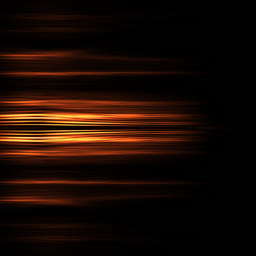
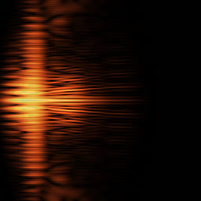
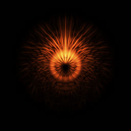
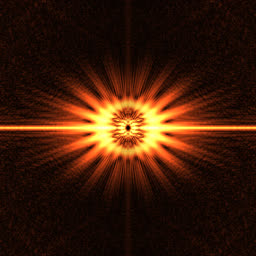
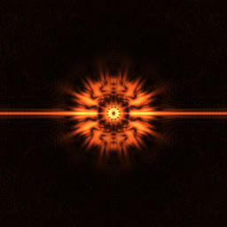
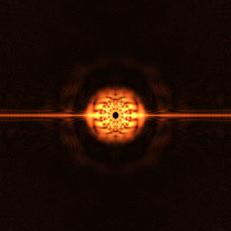
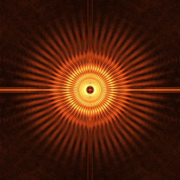
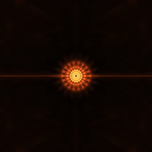

# Radon Transform

_08/2023_

This visualization of sound is inspired by the [Radon transform](https://en.wikipedia.org/wiki/Radon_transform).

Step 1: Compute the usual [spectrogram](https://en.wikipedia.org/wiki/Short-time_Fourier_transform)

- 16 kHz
- Frame size: 2048
- Num frames: 1024

Step 2: Compute the [auto-correlation](https://en.wikipedia.org/wiki/Autocorrelation) of each frame. This can be done by computing `re*re+im*im` of each component of the FFT, and then applying the inverse FFT.

Step 3: Following the idea of the Radon transform, re-arrange the auto-correlation frames as diameters of a circle.

There is a small improvisation here. If we were to follow the idea of the Radon transform strictly, each diameter of the circle would represent a different timeframe, so each column of the previous ACF image would become a diameter. The end result would be interesting, but not visually appealing. The improvisation is to re-arrange the ACF columns as circumferences.

Step 4: Apply the inverse FFT on the circular image.

In the Radon transform, this step restores the 3D/2D spatial data from a set of projections (CT scans), so an interpretation of this image is it's a 2D object whose average density at all angles look like the diameters of the image at step 3.

Other examples of vowel sounds:

A flute sound for comparison (the same sound at 16 kHz and 48 kHz):

Images are clickable.
